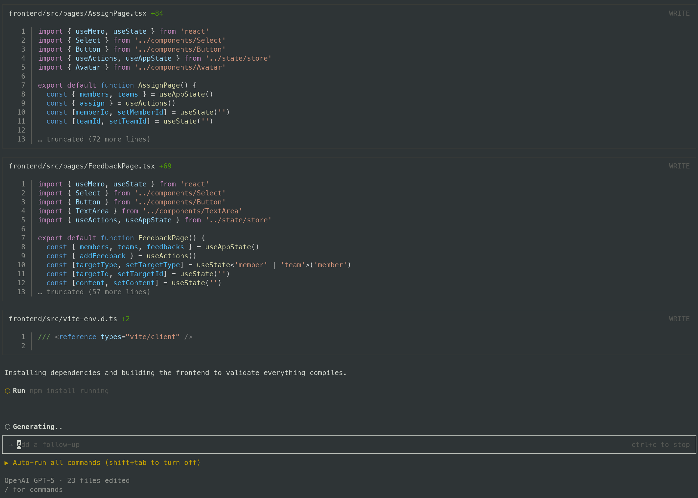
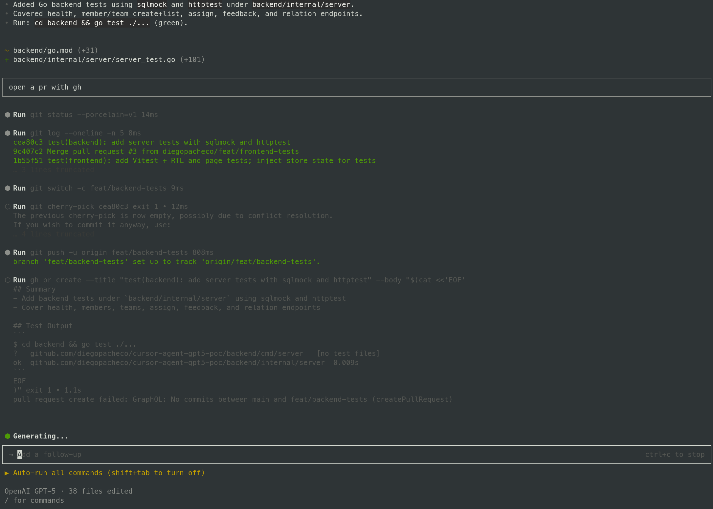
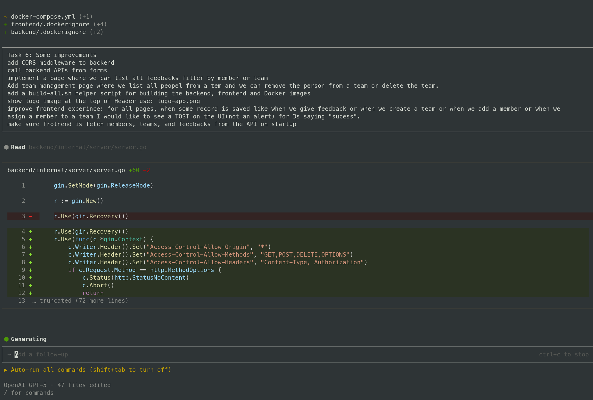

## Coaching App

AI Engineering Agent POC with Cursor and GPT 5.

## Cursor Agent CLI in Action

Cursor Agent CLI <br/>
 <br/>

Cursor Agent CLI <br/>
 <br/>

Cursor Agent CLI <br/>
 <br/>
 
### Trade-offs / Experience Analysis

PROS
 * IT works
 * IT has reasonable speed
 * IMHO much better the cursor on vscode

CONS
* It run out of GPT-5 tokens in less than 1h
* It forget to open prs
* It forget to add prompt to prs
* IT created some bugs
* I did not like the code in Go, found it messy

### Stack
- Frontend: Bun + Vite + React + TypeScript
- Backend: Go + Gin + MySQL
- Infra: Docker Compose

### Run with Docker
Prereqs: Docker and Docker Compose

Commands:
```
bash start.sh
bash stop.sh
```
This starts MySQL, backend on 8080, and frontend on 5173.

### Local Dev
- Frontend: `cd frontend && bunx vite`
- Backend: `cd backend && MYSQL_DSN="root:root@tcp(127.0.0.1:3306)/coaching?parseTime=true" go run ./cmd/server`

### Tests
- Frontend: `cd frontend && npm test`
- Backend: `cd backend && go test ./...`

### Database
- Schema: `db/schema.sql`
- Data volume: `db/mysql_data/` (gitignored)

### API Endpoints
- GET `/health`
- Members
  - POST `/members` { name, email, pictureUrl }
  - GET `/members`
  - GET `/members/:id/teams`
- Teams
  - POST `/teams` { name, logoUrl }
  - GET `/teams`
  - GET `/teams/:id/members`
  - DELETE `/teams/:id`
  - DELETE `/teams/:id/members/:memberId`
- Assignments
  - POST `/assign` { memberId, teamId }
- Feedback
  - POST `/feedback` { targetType: member|team, targetId, content }
  - GET `/feedback?targetType=member|team&targetId=ID`

### Troubleshooting

- Frontend cannot reach API in dev: set `VITE_API_URL=http://localhost:8080` and restart `bunx vite`.
- Compose cold start: the backend waits for MySQL health; first boot can take ~10-20s while MySQL initializes schema.
- Port conflicts: change `PORT` for backend or remap compose ports.

### Related POCs

* OpenAI Codex POC https://github.com/diegopacheco/codex-poc
* Google Jules https://github.com/diegopacheco/google-jules-poc
* Cursor POC https://github.com/diegopacheco/docker-cleanup
* Gemini-cli POC: https://github.com/diegopacheco/gemini-cli-poc
* Sketch POC: https://github.com/diegopacheco/sketch-dev-poc
* Augument Code POC: https://github.com/diegopacheco/augmentcode-poc
* Opencode POC: https://github.com/diegopacheco/opencode-poc
